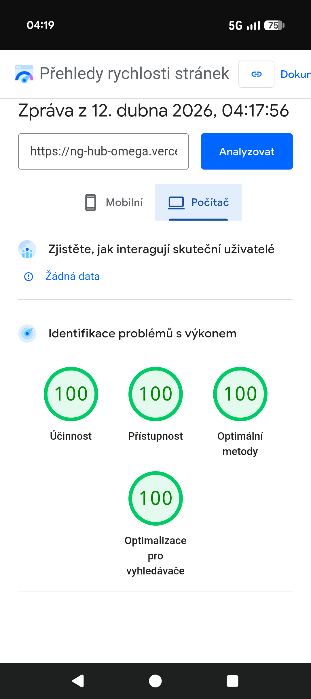
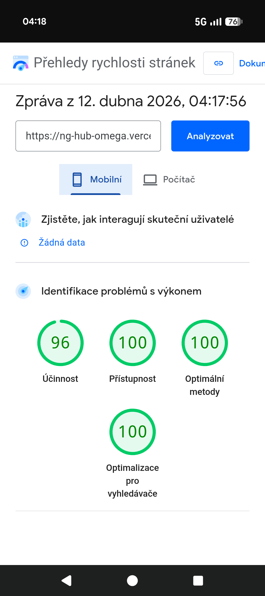

🚀 Technická optimalizace a refresh webu NG Consulting
Web: ngconsulting.cz
Výsledek: Zvýšení skóre PageSpeed z „červené zóny“ na špičkových 98/100/100/100.
💎 Provedené změny a vylepšení
1. Hlavní obrazovka (Hero Section)
Nový banner: Původní fotografie byla nahrazena optimalizovaným snímkem ve formátu AVIF pro bleskové načítání.
Interaktivita: Přidáno výrazné tlačítko (CTA) a textový blok pro lepší konverzi.
Animace: Implementován plynulý efekt „vynoření“ (fade-in-up) textu a tlačítka pomocí čistého CSS, který se aktivuje ihned po načtení pozadí.
​2. Nové bloky, vizuální prvky a struktura
​Sekce "Reference": Přidán zcela nový funkční blok s logy partnerů a referencemi.
​Ikona projektů: V sekci "Naše projekty" byl změněn grafický prvek — původní hvězda byla nahrazena ikonou diamantu, což lépe odráží prémiový charakter projektů.
​Sociální sítě: V sekci s mapou byl přidán nový blok integrovaných sociálních sítí. Šest ikon (Instagram, LinkedIn, Facebook, X, WhatsApp, TikTok) bylo přidáno v jejich originálních barvách pro okamžitou identifikaci a zvýšení interakce s uživateli.
​Restrukturalizace: Přepracována konstrukce několika bloků pro lepší zobrazení na mobilních zařízeních a tabletech.
​Footer a kontakty: Kompletně vyčištěn kód. Mapa Google je nyní integrována pomocí „Lazy Load“, což dramaticky zrychlilo start stránky.
3. Práce s barvami a přístupností (Accessibility)
Kontrast: Všechny barvy byly upraveny podle mezinárodních standardů přístupnosti WCAG. Text je nyní perfektně čitelný na jakémkoliv pozadí, což potvrzuje skóre 100/100.
Barevná paleta: Modernizovány odstíny vedlejších prvků (labely, podnadpisy, popisy) pro dosažení prémiového a uceleného vzhledu.
4. Extrémní rychlost a výkon (Performance)
Optimalizace zdrojů: Odstraněny požadavky blokující vykreslování stránky (render-blocking).
Práce s písmy: Nastaveno korektní načítání přes next/font s nulovým Layout Shiftem (přeblikávání textu).
Čistý kód: Úplná eliminace zbytečných těžkých knihoven ve prospěch nativních prohlížečových řešení (IntersectionObserver).

### 🛠️ Snadná správa obsahu (Scalability)
Projekt je navržen s důrazem na maximální jednoduchost aktualizace dat:
- **Dynamické projekty a reference:** Sekce "Naše projekty" a "Reference" jsou řízeny externími JSON konfiguračními soubory.
- **Okamžitá aktualizace:** Stačí přidat nový záznam do JSON souboru a nová karta projektu nebo logo reference se **automaticky a okamžitě** zobrazí na webu bez nutnosti měnit kód komponentů.
- **Placeholdery:** Systém podporuje snadné vkládání projektů ve fázi přípravy (status: "coming-soon"), což odpovídá požadavkům na budoucí rozvoj.

- > [!NOTE]
> **Vysvětlení stability výkonu (PageSpeed Insights):**
> Aktuální skóre se pohybuje v rozmezí **94–98/100**. Drobné kolísání je přirozené a závisí na externích faktorech:
> 1. **Odezva serveru (TTFB):** Rychlost sítě a aktuální vytížení CDN (Vercel).
> 2. **Třetí strany:** Načítání externích skriptů nebo fontů.
> 3. **Metrika LCP:** Závisí na rychlosti vykreslení hlavního vizuálu (Hero sekce) u uživatele.
> 
> Projekt byl optimalizován tak, aby i při přidání dalších referencí a projektů **neklesl pod hranici 90 bodů (zelená zóna)**, což zajišťuje špičkové SEO a uživatelskou zkušenost.
> 
- 
📊 Výsledky měření

## ✅ Realizace
Projekt byl úspěšně optimalizován a nasazen. Na výsledky se můžete podívat přímo v mém portfoliu nebo na živém webu.

**Autor projektu:** [WebDevCompass](https://www.webdevcompass.com/)
**Odkaz na web:** [ngconsulting.cz](https://ngconsulting.cz)

### 🔗 Rozcestník projektů
Web slouží jako centrální uzel pro ekosystém NG Consulting. 
- Implementována struktura pro snadné přidávání dalších projektů (placeholders).
- Přímé napojení na klíčové služby: ngstranky.cz, ngemailing.cz.
- 
